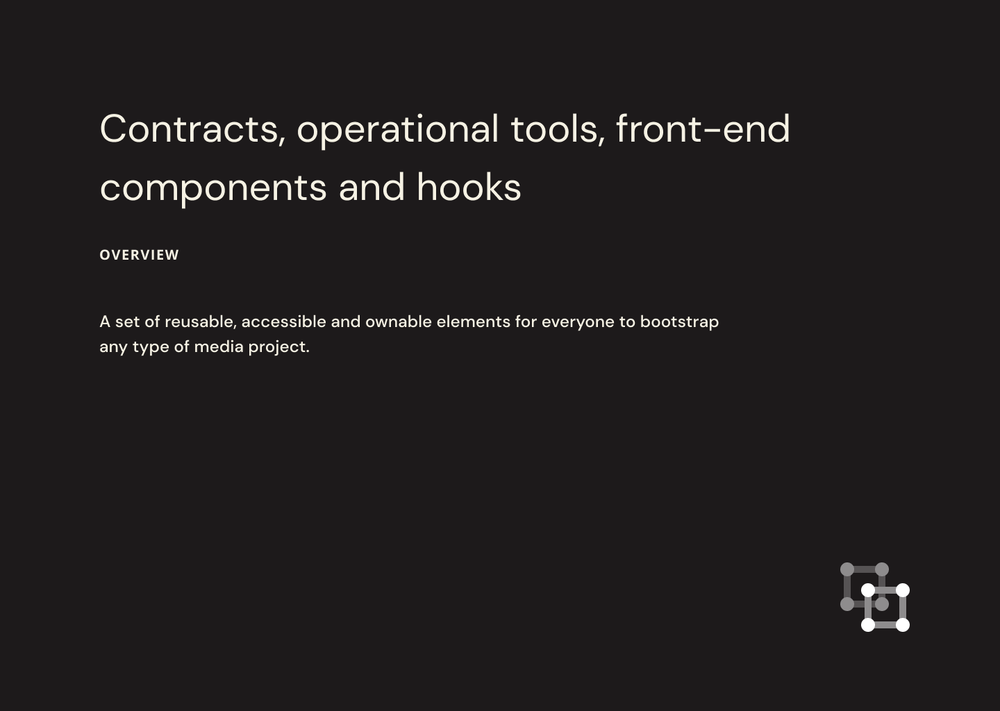

# Introduction

## Links

* [Docs](https://docs.ysn.design)
* [Components](https://master--60d9b2ac2cf86a00396f9b0f.chromatic.com)
* [Testnet](https://test.ysn.design)

## Concepts

**YSN** is an experimental project on the [NEAR sharded blockchain](https://near.org) that puts together non-fungible tokens, fungible-tokens as social tokens. This token is then the base for a decentralized organization.

A palette for building an open web on NEAR. The contracts are currently geared towards generative art as a great way to create communities, but the idea is that any type of media primitives, from text to music, can be integrated.

The goal of this repo is to allow any creator to be able to come and have a set of tools to bring value in for what they make. This means front-end hooks, themed components, and composable smart contracts that respect standards but give room for creativity and options. It's still not there but the fundamentals are in place.

The long-term goal is to have an ecosystem of media projects forked from here and that come together through their tokens and DAOs with value flowing in from [_media_](https://cryptomedia.wtf).

## Plans

